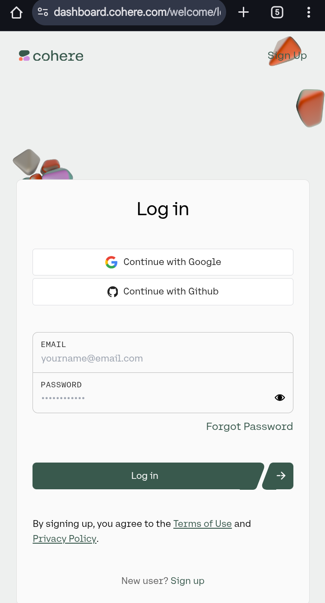
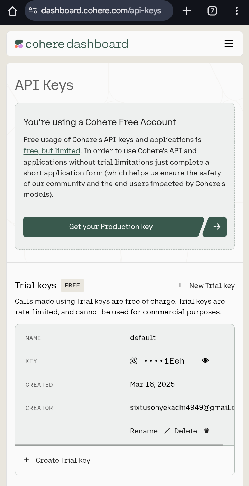

To access and utilize Cohere's language models, follow this step-by-step guide designed for developers new to the platform.

A comprehensive guide for developers to access and utilize Cohere's language models, including platform options, account setup, API key generation, SDK installation, and model integration.
# Getting Started with Cohere's Language Models
Cohere provides versatile language models accessible through various platforms. This guide will walk you through selecting the appropriate platform, setting up your account, obtaining an API key, installing the SDK, and integrating the models into your applications.

## 1. Choose Your Platform

Cohere's models are accessible through various platforms. Select the one that aligns with your requirements:

### a. Cohere Platform

The quickest way to start using Cohere’s models, hosted on Cohere's infrastructure.

- **Steps to Access:**
  1. **Sign Up:** Visit the [Cohere Dashboard](https://dashboard.cohere.ai/welcome/login) and create an account.
   

  2. **Obtain an API Key:** After logging in, navigate to the [API Keys section](https://dashboard.cohere.ai/api-keys) to generate a new key.
   

### b. Private Deployments

Ideal for enterprises aiming to deploy Cohere's models on private cloud infrastructure or on-premises.

- **Setup Guide:** Refer to the [Deployment Options Overview](https://docs.cohere.com/v2/docs/deployment-options-overview) for detailed instructions.

### c. Cloud AI Services

Access Cohere's models via managed services from major cloud providers:

- **Amazon SageMaker:** Follow the [Amazon SageMaker Setup Guide](https://docs.cohere.com/v2/docs/amazon-sagemaker-setup-guide) to integrate Cohere's offerings.
- **Azure AI Foundry:** Consult Microsoft's [Azure AI Services](https://azure.microsoft.com/en-us/services/machine-learning/) documentation for integration details.
- **Oracle OCI:** Use the [Oracle Cloud Infrastructure Documentation](https://docs.oracle.com/en-us/iaas/Content/home.htm) to set up Cohere's models.

## 2. Install the Cohere SDK

To interact seamlessly with Cohere's models, install the appropriate SDK for your programming language. Cohere supports SDKs in multiple languages:

- **Python:** Use the following command to install the Python SDK:

  ```bash
  pip install -U cohere
  ```


  For detailed instructions, refer to the [Cohere Python SDK Installation Guide](https://docs.cohere.com/v1/docs/get-started-installation).

- **TypeScript:** Installation details are available in the [Cohere TypeScript SDK Documentation](https://docs.cohere.com/v1/docs/get-started-installation).

- **Java:** Refer to the [Cohere Java SDK Setup Instructions](https://docs.cohere.com/v1/docs/get-started-installation) for guidance.

- **Go:** Consult the [Cohere Go SDK Installation Guide](https://docs.cohere.com/v1/docs/get-started-installation) for setup steps.

## 3. Utilize Cohere's Models

After setting up the SDK, you can start using Cohere's models. Here's a basic example using the Python SDK:

```python
import cohere

# Initialize the Cohere client with your API key
co = cohere.Client('YOUR_API_KEY')

# Generate a response using the 'command' model
response = co.generate(
  model='command',
  prompt='Translate the following English text to French: "Hello, how are you?"',
  max_tokens=50
)

# Print the generated response
print(response.generations[0].text)
```


This script sends a prompt to the Cohere model and prints the generated response. For more detailed examples and advanced usage, visit the [Cohere API Reference](https://docs.cohere.com/v2/reference/about).

## 4. Explore Additional Resources

To deepen your understanding and make the most of Cohere's offerings, consider exploring the following resources:

- **Guides and Concepts:** Gain a deeper understanding of how to use the API and customize models by visiting the [Guides and Concepts section](https://docs.cohere.com/cohere-documentation).

- **LLM University:** Join Cohere's learning hub to master Enterprise AI with expert-led courses and step-by-step guides at [LLM University](https://docs.cohere.com/cohere-documentation).

- **Cookbooks:** Access practical examples and recipes for using Cohere's models in various applications through the [Cookbooks](https://docs.cohere.com/cohere-documentation).

---

By following these steps and utilizing the provided resources, you can effectively integrate and leverage Cohere's language models in your applications.
