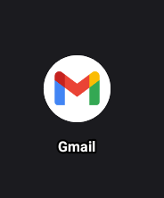

Setting up a new Gmail account on your Android device is a straightforward process that allows you to access Google's suite of services, including email, calendars, and more. This guide will walk you through each step, ensuring you can start using your new Gmail account with ease.

Learn how to create and set up a new Gmail account on your Android device with this easy-to-follow, step-by-step guide designed for beginners.

**Table of Contents:**

1. [Introduction](#introduction)
2. [Prerequisites](#prerequisites)
3. [Step 1: Open the Gmail App](#step-1-open-the-gmail-app)
4. [Step 2: Start the Account Creation Process](#step-2-start-the-account-creation-process)
5. [Step 3: Enter Your Personal Information](#step-3-enter-your-personal-information)
6. [Step 4: Choose a Username](#step-4-choose-a-username)
7. [Step 5: Create a Password](#step-5-create-a-password)
8. [Step 6: Add Recovery Information](#step-6-add-recovery-information)
9. [Step 7: Agree to Terms and Conditions](#step-7-agree-to-terms-and-conditions)
10. [Step 8: Verify Your Account](#step-8-verify-your-account)
11. [Step 9: Access Your New Gmail Account](#step-9-access-your-new-gmail-account)
12. [Conclusion](#conclusion)

---

**Introduction**

Creating a Gmail account on your Android device not only provides you with a robust email service but also grants access to various Google services like Google Drive, Google Photos, and the Play Store. This guide is tailored for beginners and will help you set up your Gmail account step by step.

**Prerequisites**

- An Android device with internet connectivity.
- The Gmail app installed (usually pre-installed on most Android devices).

**Step 1: Open the Gmail App**

Locate and tap the **Gmail** app icon on your device. It's typically represented by a white envelope with a red border.
 

**Step 2: Start the Account Creation Process**

In the Gmail app:

- Tap **Add an email address**.
- Select **Google** as the email provider.
- Tap **Create account** and choose **For myself**.

**Step 3: Enter Your Personal Information**

You'll be prompted to enter your first and last name:

- Type your **First name** and **Last name**.
- Tap **Next**.

**Step 4: Choose a Username**

Decide on a unique Gmail address:

- Enter your desired email address (e.g., **yourname@gmail.com**).
- If the username is taken, you'll be prompted to choose another.
- Tap **Next**.

**Step 5: Create a Password**

Set a strong password:

- Enter a password with at least 8 characters, combining letters, numbers, and symbols.
- Re-enter the password to confirm.
- Tap **Next**.

**Step 6: Add Recovery Information**

For account security:

- Add a phone number and/or recovery email (optional but recommended).
- Tap **Next**.

**Step 7: Agree to Terms and Conditions**

Review Google's terms:

- Scroll through the **Privacy and Terms**.
- Tap **I agree** to proceed.

**Step 8: Verify Your Account**

Google may require verification:

- If prompted, enter the verification code sent to your phone number.
- Tap **Verify**.

**Step 9: Access Your New Gmail Account**

Once verified:

- You'll be directed to your new Gmail inbox.
- Explore the features and settings as desired.

**Conclusion**

Congratulations! You've successfully set up your new Gmail account on your Android device. You can now send and receive emails, as well as access other Google services seamlessly.

For a visual walkthrough, you might find this video tutorial helpful:

videoHow to Create Google Account On Your Android Phone (2025)turn0search2
