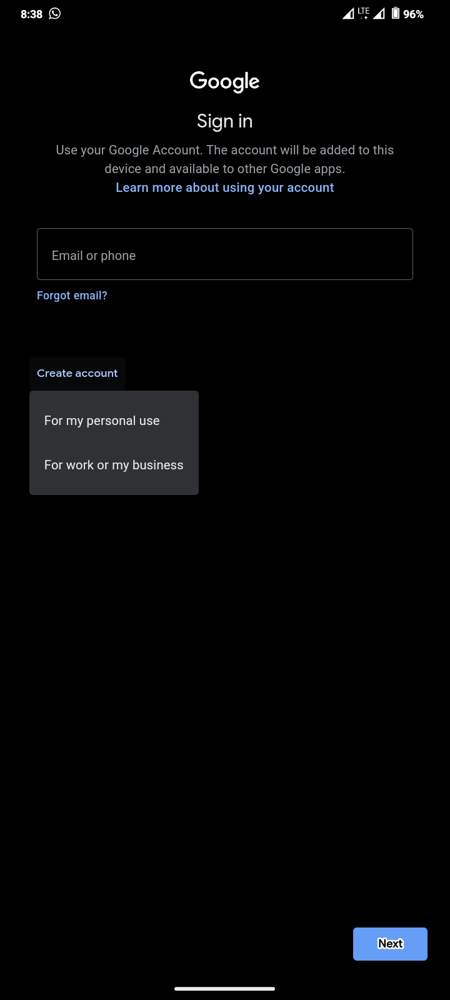

**Creating and Setting Up a New Gmail Account on Android: A Step-by-Step Guide**

Learn how to efficiently create and configure a new Gmail account directly on your Android device with this detailed, step-by-step guide.

---

**Table of Contents**

1. [Introduction](#introduction)
2. [Prerequisites](#prerequisites)
3. [Step 1: Accessing Device Settings](#step-1-accessing-device-settings)
4. [Step 2: Navigating to Accounts](#step-2-navigating-to-accounts)
5. [Step 3: Adding a New Account](#step-3-adding-a-new-account)
6. [Step 4: Selecting Google Account](#step-4-selecting-google-account)
7. [Step 5: Creating a New Account](#step-5-creating-a-new-account)
8. [Step 6: Entering Personal Information](#step-6-entering-personal-information)
9. [Step 7: Choosing a Username](#step-7-choosing-a-username)
10. [Step 8: Setting a Password](#step-8-setting-a-password)
11. [Step 9: Adding Recovery Options](#step-9-adding-recovery-options)
12. [Step 10: Agreeing to Terms and Conditions](#step-10-agreeing-to-terms-and-conditions)
13. [Step 11: Verifying Account Setup](#step-11-verifying-account-setup)
14. [Conclusion](#conclusion)

---

**Introduction**

Creating a Gmail account on your Android device is a straightforward process that integrates seamlessly with Google's suite of services. This guide provides a step-by-step walkthrough to help you set up your new Gmail account efficiently.

---

**Prerequisites**

- **Android Device:** Ensure your device is powered on and connected to the internet.
- **Personal Information:** Have your desired email address, password, and recovery options ready.

---

**Step 1: Accessing Device Settings**

Begin by opening the **Settings** app on your Android device. This is typically represented by a gear icon.

---

**Step 2: Navigating to Accounts**

Scroll down and tap on **Accounts** or **Password & accounts**, depending on your device model.
 
---

**Step 3: Adding a New Account**

In the Accounts section, select **Add Account** to initiate the process of adding a new account to your device.

---

**Step 4: Selecting Google Account**

From the list of account types, choose **Google** to create a new Gmail account.  

---

**Step 5: Creating a New Account**

On the Google sign-in screen, tap on **Create account** and select **For myself**.
 

---

**Step 6: Entering Personal Information**
 
Enter your **First Name** and **Last Name**, then tap **Next**. 

---

**Step 7: Choosing a Username 

Input your desired email address (e.g., username@gmail.com) and tap **Next**. If the username is already taken, you'll be prompted to choose another. 
 

---

**Step 8: Setting a Password**

Create a strong password following Google's guidelines and confirm it by entering it again. Tap **Next** to proceed.
 

---

**Step 9: Adding Recovery Options**

Provide a phone number and/or recovery email to secure your account. These are optional but recommended for account recovery.

---

**Step 10: Agreeing to Terms and Conditions**

Review Google's Privacy Policy and Terms of Service. Tap **I agree** to continue.
  

---

**Step 11: Verifying Account Setup**

Once all steps are completed, your new Gmail account will be set up on your device, ready for use.

---

**Conclusion**

By following these steps, you've successfully created and configured a new Gmail account on your Android device. This account allows you to access a wide range of Google services seamlessly integrated with your device.

---
