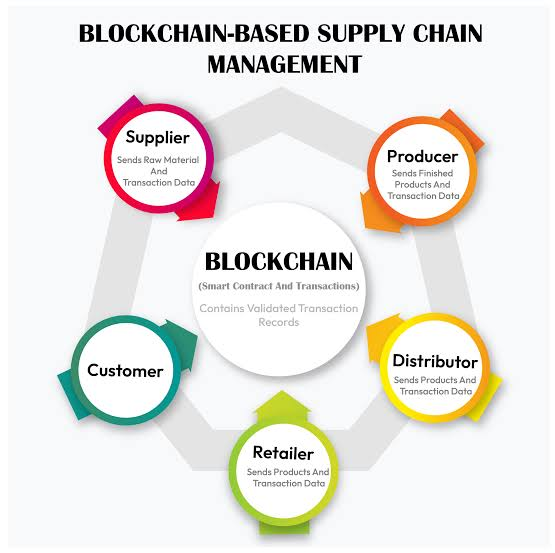

# Blockchain Beyond Cryptocurrency: Transforming Industries with Transparency and Security

# Blockchain Beyond Cryptocurrency: Transforming Industries with Transparency and Security

## Introduction
When people hear the word "blockchain," they often think of cryptocurrencies like Bitcoin and Ethereum. However, blockchain technology has applications far beyond digital currencies. Its decentralized, secure, and transparent nature is revolutionizing industries such as supply chain management, healthcare, finance, real estate, government services, education, energy, and logistics. By eliminating middlemen, increasing security, and improving trust, blockchain is shaping the future of digital transactions and data management. This article explores its diverse applications, real-world examples, expert insights, and future trends.

## Understanding Blockchain: Key Concepts
 
To understand why blockchain is so powerful, it's important to know its key principles:
- **Decentralization**: Instead of being controlled by one authority, blockchain data is stored across a network of computers, making it more secure and resistant to hacking.
- **Immutability**: Once information is recorded on the blockchain, it cannot be changed or deleted, preventing fraud and ensuring accuracy.
- **Transparency**: All transactions on a blockchain can be verified by users, which builds trust and accountability.
- **Security**: Advanced encryption protects data from being altered or stolen.
- **Smart Contracts**: These are self-executing agreements that automatically complete transactions when conditions are met, reducing the need for third parties.
- **Tokenization**: Blockchain allows assets like real estate, art, and digital content to be divided into digital tokens, making ownership and trade easier.

## Blockchain Applications Beyond Cryptocurrency

### 1. Supply Chain Management
Blockchain improves product tracking, prevents fraud, and increases efficiency in global supply chains. Companies like **IBM, Maersk, and Walmart** use blockchain to trace goods from their origin to the final destination.
 
**Example:** IBM’s Food Trust blockchain helps retailers trace food sources in seconds, reducing contamination risks and increasing consumer confidence.

### 2. Healthcare and Medical Records
Blockchain helps securely store and share medical data, improving privacy and making it easier for healthcare providers to access patient information.
 
**Example:** MedRec, a system developed by MIT, allows patients to control who can access their medical records while ensuring that their data remains authentic and secure.

### 3. Financial Services and Banking
Blockchain makes banking transactions faster, safer, and more transparent, cutting down costs and fraud.
 
**Example:** **RippleNet** allows instant, low-cost international money transfers, while **JPMorgan’s Quorum** blockchain speeds up bank-to-bank transactions.

### 4. Intellectual Property and Digital Rights Management
Blockchain protects creative work by providing clear proof of ownership for artists, musicians, and content creators.

**Example:** KodakOne uses blockchain to help photographers track and license their images, preventing unauthorized use.

### 5. Smart Contracts and Legal Applications
Legal agreements can be automated using smart contracts, reducing paperwork and ensuring compliance.

**Example:** Ethereum-based smart contracts make real estate transactions more secure by automatically transferring property ownership after payment is verified.

### 6. Real Estate and Property Transactions
Blockchain reduces fraud and speeds up property transactions by maintaining a secure and transparent ownership record.
 
**Example:** Propy, a blockchain real estate platform, streamlines property purchases by eliminating excessive paperwork and third-party involvement.

### 7. Government and Public Sector
Governments use blockchain to securely store records, reduce fraud, and improve public services.

**Example:** Estonia has implemented blockchain for digital identity verification, healthcare, and e-government services, improving efficiency and security.

### 8. Voting Systems and Elections
Blockchain-based voting ensures that elections are secure, transparent, and tamper-proof, reducing fraud risks.
 
**Example:** Voatz, a blockchain-powered voting app, has been tested in U.S. elections, allowing military personnel and overseas citizens to vote securely.

### 9. Education and Credential Verification
Blockchain makes it easy for institutions to issue and verify academic credentials, preventing fraud.

**Example:** The University of Nicosia issues blockchain-based diplomas, allowing instant and verifiable credential authentication.

### 10. Environmental and Sustainability Initiatives
Blockchain can track carbon emissions, ensure ethical sourcing, and support sustainability efforts.

**Example:** IBM’s **Plastic Bank** blockchain rewards people with digital tokens for collecting and recycling plastic waste.

### 11. Energy and Utilities
Blockchain allows peer-to-peer energy trading and improves electricity distribution efficiency.  

**Example:** Power Ledger, an Australian blockchain platform, enables homeowners to sell excess solar energy to neighbors, reducing reliance on traditional power grids.

### 12. Logistics and Transportation
Blockchain improves logistics by reducing paperwork, enhancing tracking, and preventing fraud in the supply chain.

**Example:** DHL and Maersk use blockchain to make supply chain management more transparent and efficient, reducing delays.

### 13. Identity Management and Digital Identity
Blockchain-based identity systems allow people to have more control over their personal data and improve security.

**Example:** Microsoft’s **ION** blockchain network provides verifiable, decentralized digital identities, reducing identity theft risks.

### 14. Food Safety and Agriculture
Blockchain increases food safety by tracking products from farm to table, ensuring transparency.

**Example:** Nestlé uses blockchain to verify the origin of its coffee beans, giving consumers confidence in their ethical sourcing.

## Expert Insights
Industry leaders recognize blockchain’s impact across different fields:
- **Don Tapscott**, co-author of *Blockchain Revolution*, says, "Blockchain is the foundation of a new digital economy, fostering trust and transparency."
- **Vitalik Buterin**, Ethereum co-founder, emphasizes, "Decentralized applications and smart contracts are reshaping industries by improving efficiency."
- **Andreas Antonopoulos**, a blockchain advocate, explains, "Blockchain’s true power lies in eliminating middlemen and enabling direct, secure transactions."
- **Caitlin Long**, a blockchain banking expert, adds, "Blockchain can solve inefficiencies in financial systems, reducing settlement times and fraud risks."

## Key Takeaways
- Blockchain has applications far beyond cryptocurrency, transforming industries such as supply chain, healthcare, finance, and government services.
- Its decentralized nature enhances transparency, security, and efficiency in various fields.
- Governments and businesses are using blockchain to prevent fraud and improve record-keeping.
- Blockchain is driving innovation in education, sustainability, identity management, and logistics.
- Experts predict that blockchain will continue to reshape digital transactions and global economies.
 
## Conclusion
Blockchain is not just about digital money, it is a groundbreaking technology that is reshaping industries by increasing transparency, security, and efficiency. As adoption grows, blockchain’s ability to reduce fraud, eliminate middlemen, and streamline transactions will continue to influence businesses, governments, and individuals worldwide. While challenges like regulation and infrastructure remain, the future of blockchain promises a more secure and transparent digital landscape for generations to come.
